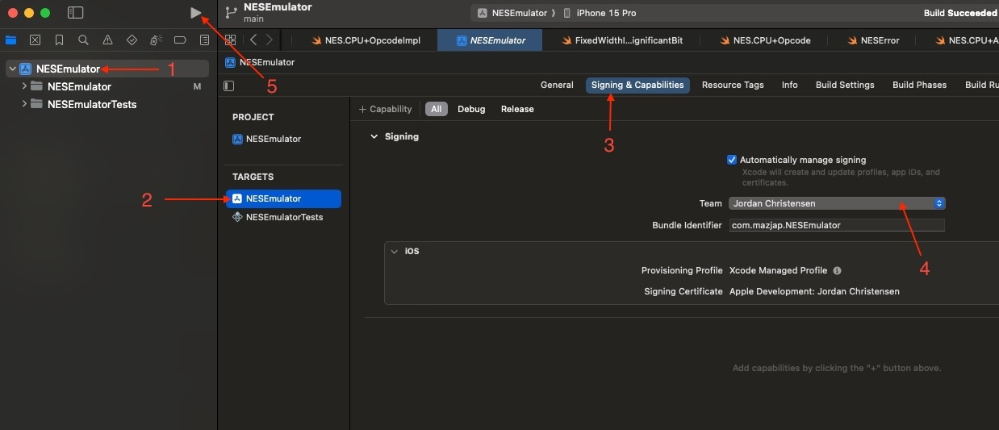

# SwiftNES

A Nintendo Entertainment System (NES) emulator written in Swift. The goal of this project is to deepen my understanding of system architecture, assembly language, and the inner workings of the NES by accurately replicating its functionality.

## Current State of the Project

The following features are currently implemented:

- CPU emulation (MOS 6502)
- Memory management unit (MMU)

### Missing Features

The emulator is still in development, and several key components are not yet implemented:

- [ ] Picture Processing Unit (PPU) to render graphics
  - [ ] Need to do some research & testing (SwiftUI Canvas vs MTKView)
- [ ] Audio Processing Unit (APU) to output sound signals
  - [ ] Use `AVAudioEngine` to translate NES signals to audio
- [ ] Multiple cartridge mapper support
- [ ] Additional debugging tools
- Highly unstable instructions as described by [masswerk](https://www.masswerk.at/nowgobang/2021/6502-illegal-opcodes) (which I currently do not plan to implement)

I may consider adding:
- An assembler
- A dissasembler
- A CPU emulation UI as a debug/testing tool to
  - visualize memory & registers and how they change
  - manipulate memory & registers as the program runs
  
## Technical Implementation Details

### CPU/PPU Synchronization

This emulator uses instruction-level synchronization rather than cycle-accurate emulation. While the original NES hardware runs all components (CPU, PPU, APU) off a single master clock, this emulator completes an entire CPU instruction before updating other components. After each CPU instruction, the PPU and APU (once implemented) will be advanced by the corresponding number of cycles.

This will simplify the implementation and make debugging easier while maintaining sufficient accuracy. Timing-critical operations (like VBlank) occur at scanline/frame boundaries rather than individual cycles, so this approach will preserve the necessary timing relationships for video output. Sprite zero hits 

### Frame Rate

The original NES runs at 60.1 FPS, but this emulator will target 60 FPS to match modern displays. This will result in the emulator running ~0.17% slower than original hardware. This difference should be imperceptible during gameplay, and will avoid potential frame skips from trying to maintain 60.1 FPS on 60 Hz displays.

### Other Timing Considerations

- Audio timing: The APU will be updated in chunks rather than continuously
- Input polling: Controller input will be sampled at instruction boundaries rather than individual cycles
- DMA transfers: These will appear to happen instantly from the CPU's perspective rather than taking the correct number of cycles, though the cycle count will still be appropriately added to the timing

## Build and Run Instructions

Please ensure that you have Swift installed on your machine. This project uses Swift 6, and it's recommended to use the same version or newer.

To build and run the emulator, follow these steps:

1. **Clone the repository:**

   `git clone https://github.com/mazjap/SwiftNES.git`

3. **Navigate to the project directory:**

   `cd ./SwiftNES`

4. **Open the project with Xcode:**

   `open ./NESEmulator.xcodeproj`

5. **Change the Team used to sign the project:**

   

6. **Change the run destination and run the project:**
   
   Keyboard shortcut: `command+r`

   OR
   
   Play icon in the top left of Xcode

## Contributing

Please note that this is a personal project designed for educational purposes, and as such, contributions are not currently being accepted. However, any feedback or suggestions are welcome!

## License

This project is released under the MIT License. Attribution, while not required, is appreciated. See the [LICENSE file](./LICENSE) for more information.

## Acknowledgments

Thanks to the people behind these projects for their extensive documentation:

  1. [NESDev](https://www.nesdev.org/)
  2. [Masswerk](https://www.masswerk.at/nowgobang/2021/6502-illegal-opcodes)
  3. [Emulator101](http://www.emulator101.com/6502-addressing-modes.html)
  4. [Cdot Wiki](https://wiki.cdot.senecapolytechnic.ca/wiki/6502_Addressing_Modes)

And many more
